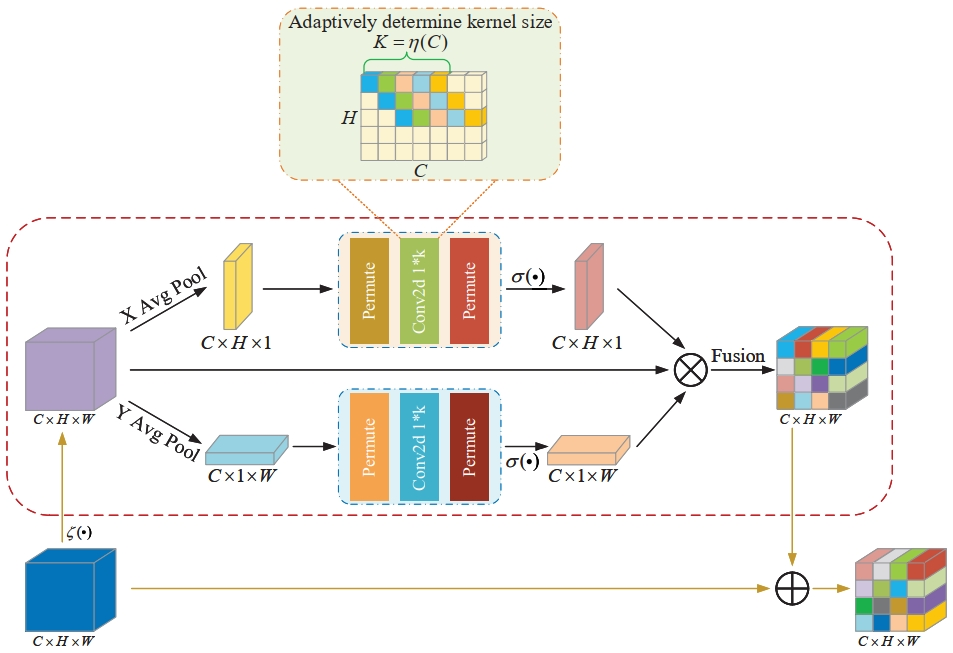
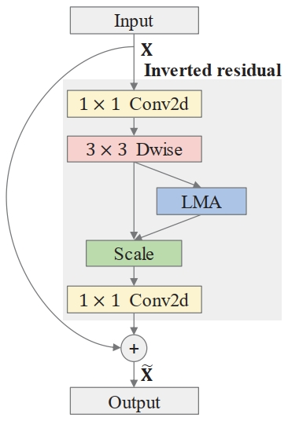
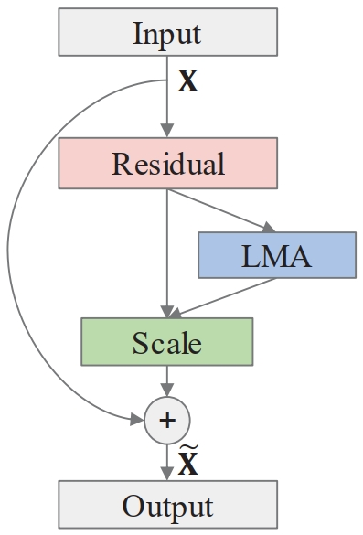
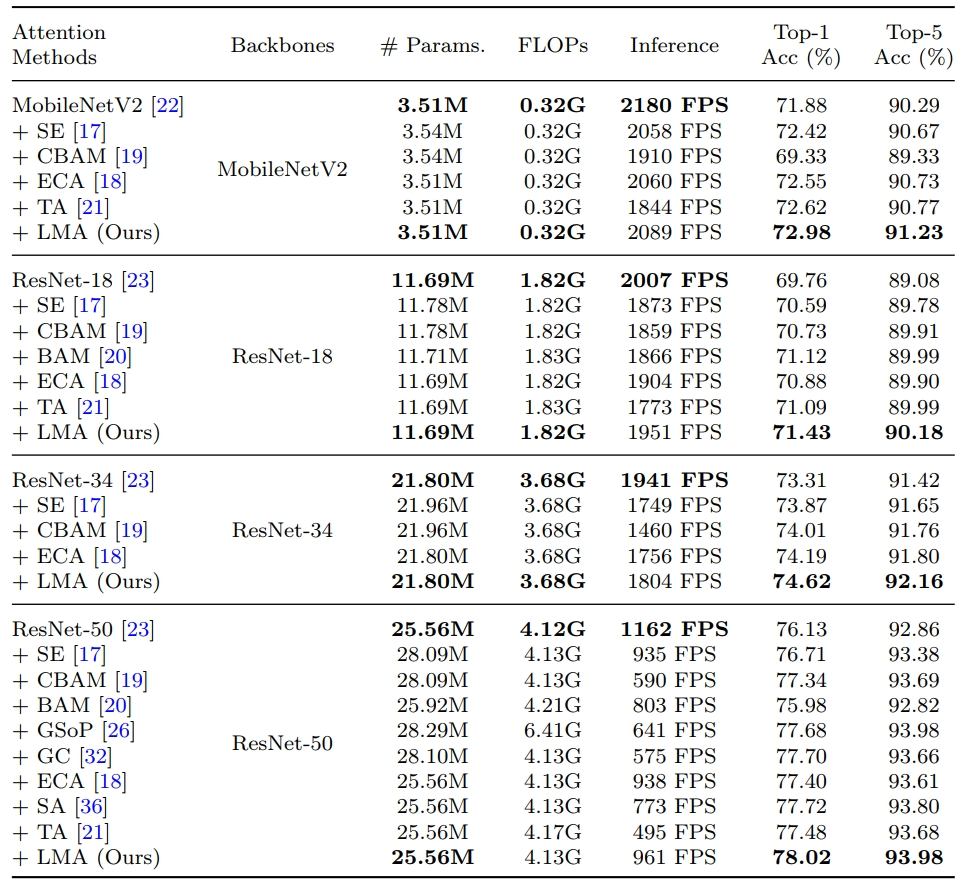
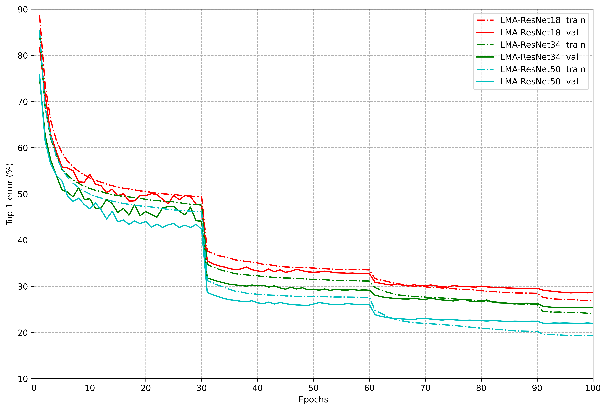
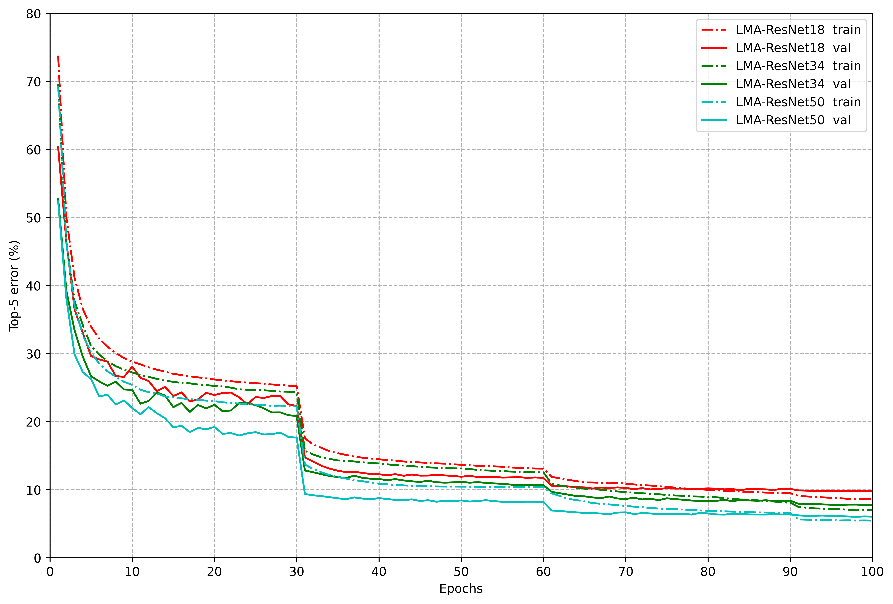

# Lightweight Mixed-domain Attention Module

***The official PyTorch implementation of "LMA: lightweight mixed-domain attention for efficient network design".***

## Method

### Lightweight mixed-domain attention

	

	Figure 1: An overview of the proposed LMA module.

**LMA.** Detail of implementations, including modules and the networks, can be found in ``Model`` in this repository. 

## Our environments and toolkits

- OS: Ubuntu 18.04.1
- CUDA: 11.6
- Python: 3.9.12
- Toolkit: PyTorch 1.10
- GPU: RTX A6000 (4x)
- [ptflops](https://github.com/sovrasov/flops-counter.pytorch)
- For generating GradCAM++ results, please follow the code on this [repository](https://github.com/jacobgil/pytorch-grad-cam)

## Incorporate the LMA module into convolutional neural networks

	

	Figure 2: The LMA-based inverted residual block.

	

	Figure 3: The LMA-based residual block.

## Overview of Results

### Classification results on ImageNet-1K

	

	Table 1: Comparison of different attention methods on the ImageNet validation set in terms of network parameters (# Params.), FLOPs, inference speed (frame per second, FPS), and Top-1/Top-5 accuracy (%).

	
	

	Figure 4: Training and validation curves of LMA-based attention module under ResNet architectures with different depths.

## Citation
If you find LMA useful in your research, please consider citing:

	@article{yu2023lma,
  		title={LMA: lightweight mixed-domain attention for efficient network design},
  		author={Yu, Yang and Zhang, Yi and Song, Zhe and Tang, Cheng-Kai},
  		journal={Applied Intelligence},
  		volume={53},
  		number={11},
  		pages={13432--13451},
  		year={2023},
  		publisher={Springer}
	}

## Contact Information

If you have any suggestion or question, you can leave a message here or contact us directly: yang_y9802@163.com. Thanks for your attention!